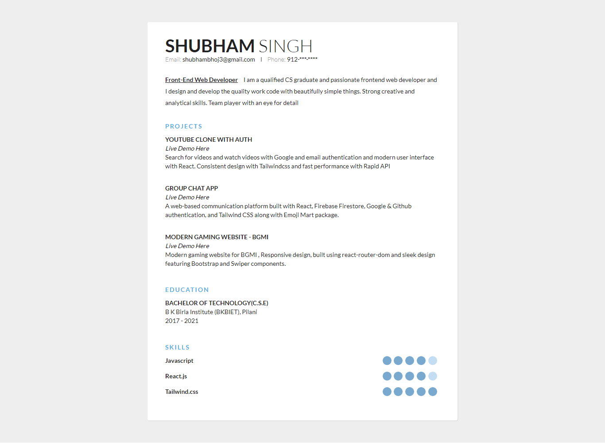
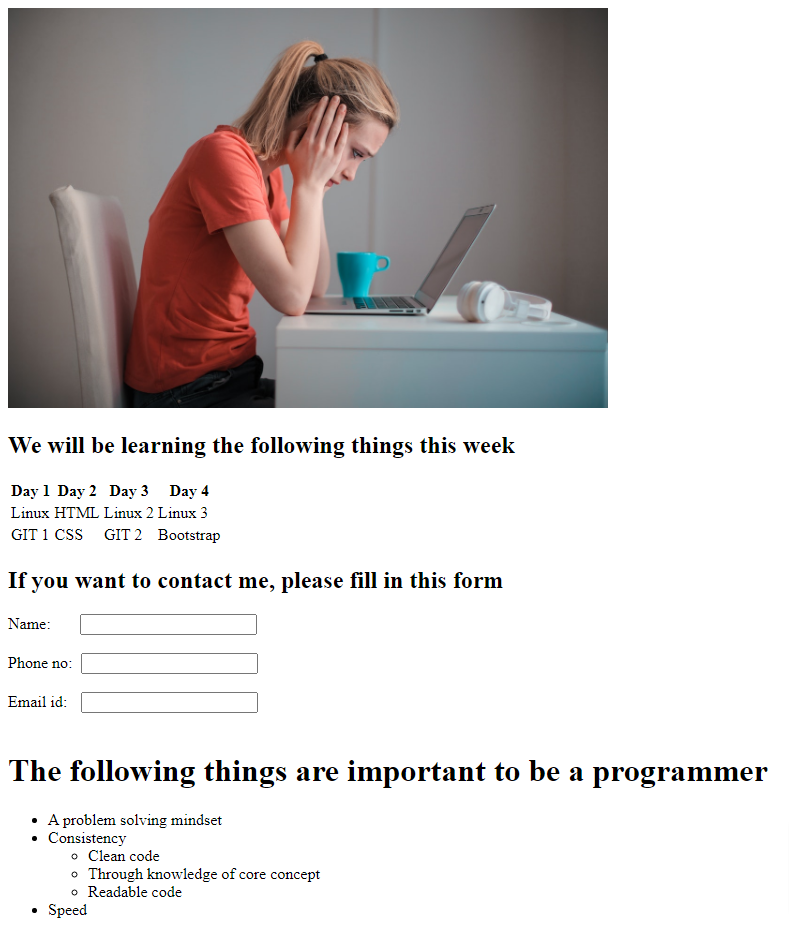
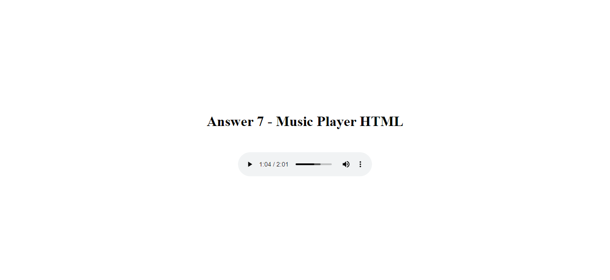
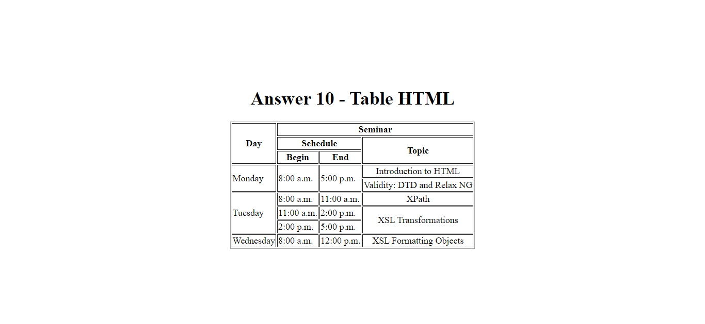

## ❄️ Answers - HTML Section ❄️

#### Here's the screencaptures of all the HTML projects.

### 📖 Answer 4 : Resume

[Code here: ](https://github.com/ShubhamSingh03/Placement_Assignment-Ineuron/blob/main/HTML/answer-4-resume.html)

### 📖 Answer 5 : Layout

[Code here: ](https://github.com/ShubhamSingh03/Placement_Assignment-Ineuron/blob/main/HTML/answer-5-layout.html)

### 📖 Answer 7 : Music Player

[Code here: ](https://github.com/ShubhamSingh03/Placement_Assignment-Ineuron/blob/main/HTML/answer-7-music_player.html)

### 📖 Answer 10 : Table

[Code here: ](https://github.com/ShubhamSingh03/Placement_Assignment-Ineuron/blob/main/HTML/answer-10-table.html)

